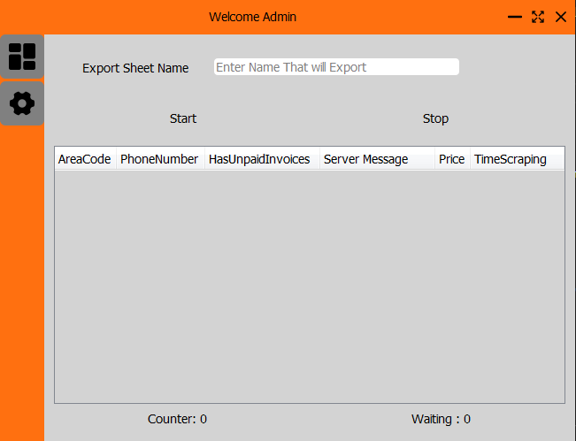
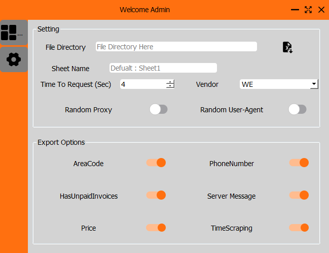

# JumiaPay
Simple App to Scrape Data From JumiaPay Website and Check if Phone Number has Invoices Or not Searching with (AreaCode , PhoneNumber) 

## Pages

* DashBoard --> To Scrape Handles From Telegram Group 
* Setting --> To Manage SendRequest and Expot Options

# Features 

* App Saving Waiting Number if you stopped it to clear waiting (Ctrl + r )
* Control send Request Time
* Full Control to Exports Options (Not Export Column if Disabled)
* Easly to add EXCEL File 
* Handling Sheet Name That You Want to Use (Write Sheet Name that Contain Data if Not "Sheet1")
* Can Changing Proxies For Each Request
* Can Changing User-agent For Each Request

# ScreenShots
 

 

## Built With Package

* Python
* Requests
* Json
* Openpyxl
* Pandas
* Datetime
* ProxyFilterAPI (My Package)
* Pyperclip

## Frameworks 
* [PyQt5](https://doc.qt.io/qtforpython/)   For Build GUI 
* [Requests](https://requests.readthedocs.io/en/latest/)  For Connect To Jumia Server
* [Pandas](https://pandas.pydata.org/) For Make Data Operations
* [Json](https://www.json.org/json-en.html) For Handling Server Request and Response

## Contact 

* [Gmail] : HeshamMoawad120120@gmail.com
* [WhatsApp] : 01111141853

# Good Luck 
## Made By K7_Team Hesham